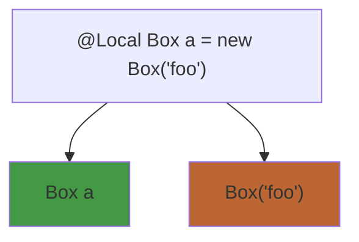
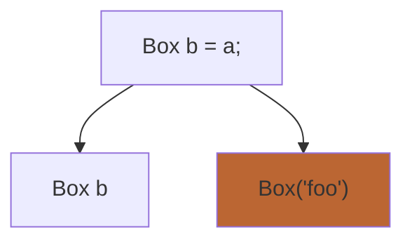
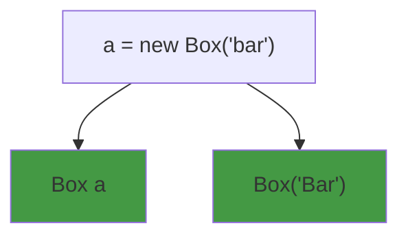

# JDala
an experimental implementation of DALA on top of Java


## Immutable

## Isolated

## Local

There are a few different ways that this can be implemented. The current way implemented only the object that is created is bound to be local, NOT the variable. Take the example below the 3 line java example is broken down to view each line and the restrictions on each.

Orange highlights the current implementation. Green & orange highlights another possible approach 

```java
    @Local Box a = new Box("foo");
    Box b = a;
    a = new Box("bar");
```







Currently, (highlighted in orange)
- Box a doesn't have any local requirement on it
- Box("foo") is restricted to be local only
- Box b doesn't have a requirement to be local
- Box('Bar') is not restricted to be local only