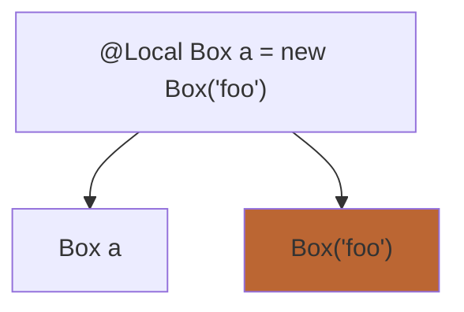
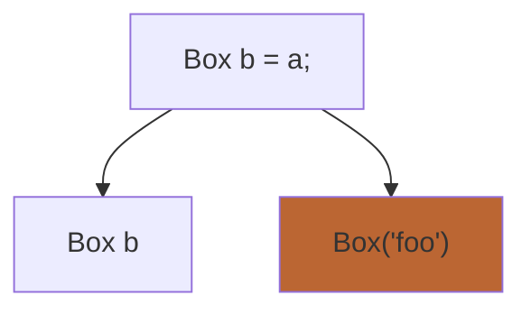
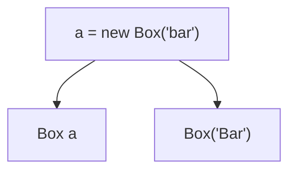

# JDala
an experimental implementation of DALA on top of Java

## Set up
The program needs to be compiled twice to run, first for the agent and second is the actual program

First run to build the java agent (and skip the tests as they need the agent to pass)
```shell
mvn clean package -DskipTests
```

Dynamic Attachment of agent needs to be set to true. If using intellij this can be done by adding opting the run configuration and adding
```shell
-Djdk.attach.allowAttachSelf=true
```
to the VM options

## Annotations
There are three possible annotations that a local variable can have. These are:

### Immutable

```java
import nz.ac.wgtn.ecs.jdala.annotation.Immutable;

@Immutable Box var = new Box("foo");
```

### Isolated

```java
import nz.ac.wgtn.ecs.jdala.annotation.Isolated;

@Isolated Box var = new Box("foo");
```

### Local

```java
import nz.ac.wgtn.ecs.jdala.annotation.Local;

@Local Box var = new Box("foo");
```


## Implementation Details
This documents the decisions that have made at certain stages and how they work.

### Annotation Persistence
There are a few different ways that this can be implemented. The current way implemented only the object that is created is bound to the annotation, NOT the variable. Take the example below the 3 line java example is broken down to view each line and the restrictions on each.

Orange highlights the current implementation. Green & orange highlights another possible approach 

```java
    @Local Box a = new Box("foo");
    Box b = a;
    a = new Box("bar");
```







Currently, (highlighted in orange)
- Box a doesn't have any local requirement on it
- Box("foo") is restricted to be local only
- Box b doesn't have a requirement to be local
- Box('Bar') is not restricted to be local only

### Object Validation
#### Variable Calls
Currently, all calls of a variable have checks that see what thread it is in and if it correctly managed.
Note: this will come at a runtime performance hit.

Code before analysis:
```java
Box a = new Box("food");
@Local Box obj = new Box("foo");
Box aliasObj = obj;
obj = new Box("bar");
obj.value = "bar2";
```

Code after analysis:
```java
Box a = new Box("food");
ThreadChecker.validate(a);
Box obj = new Box("foo");
ThreadChecker.register(obj);
ThreadChecker.validate(obj);
Box aliasObj = obj;
ThreadChecker.validate(obj);
obj = new Box("bar");
ThreadChecker.validate(obj);
obj.value = "bar2";
```

This means that even `a` which can be considered `unsafe` is validated, this is to cover for cases like reflection which mean that we better be safe by checking all possible approaches

#### Thread Detection
This program uses the access of variables as the check against the conditions set by the annotations.

This means that if an object is marked with an annotation and is passed to another thread it may not throw up and error until the object is accessed. This is fine as it still doesn't allow any changes or reads to be made without validation to occur.

#### Deep Immutability

This stems from [this](https://github.com/jensdietrich/jdala/issues/2#issuecomment-2533375836) issue.

The program will work using deep immutability meaning once an object is set to be immutable any objects contained by it are also considered to be immutable.

This causes an issue to when creating a new object like an array (and any objects that contain an array) and builder methods.

##### Example 1
```java
@Immutable ArrayList<String> immutableArrayList = new ArrayList<>();
```
This is rather useless as nothing can be added to the array as everything including the internal array is immutable.

To not limit the use of `@Immutable` arrays we allow objects to become immutable after creation.

```java
ArrayList<String> mutableArrayList = new ArrayList<>();
mutableArrayList.add("foo");
mutableArrayList.add("bar");
@Immutable ArrayList<String> immutableArrayList = mutableArrayList;
```

Now nothing can be added to the ArrayList.

