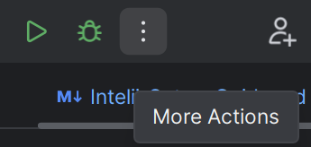
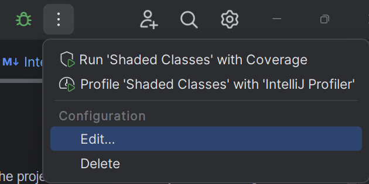
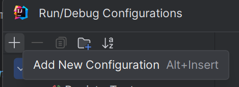
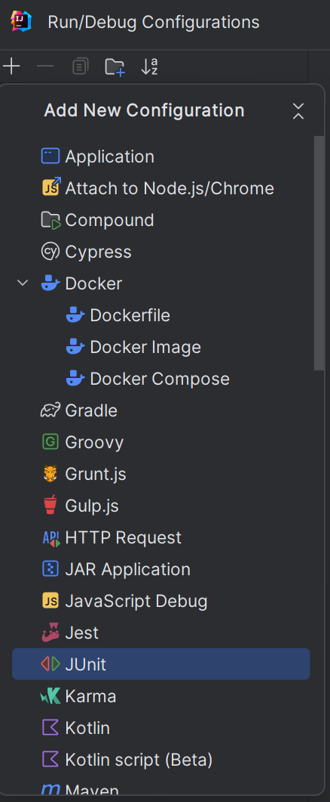
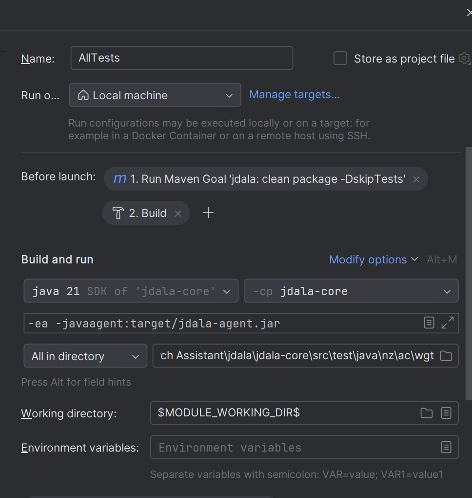

## IntelliJ Setup Guide
This guide is specifically for setting up the project to run in IntelliJ, if you are looking for the general guide please look [here](../README.md#set-up)

### Run Configuration Guide
The program needs to be compiled twice to run, first for compiling the agent and second is the actual program

1. In the top right of you screen click the `⋮` button

2. Under configuration, click `Edit...`

3. Click the `+` button and select JUNIT to add a new configuration

4. Under `-cp <No Module>` select `jdala-core` 
5. Click `Modify Options`
6. Click `Add VM Options` (if not already selected)
7. Paste `-javaagent:target/jdala-agent.jar` (`-ea` optional argument)
8. Click `Modify Options` again
9. Click `add before launch task`
10. Click `Run Maven Goal`
11. Add `clean package -DskipTests` to command line
12. Click `Ok`
13. Drag Maven Goal before build
14. Select test you want to run and give configuration a name
15. Click `Run`

It should look something like this, with your name and tests you want to run

Note: for any future run configurations it is probably just easier to copy one of the existing configurations and change the target test file.