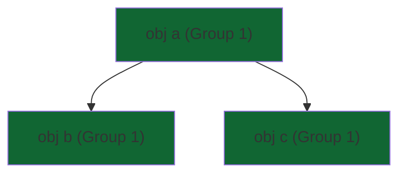
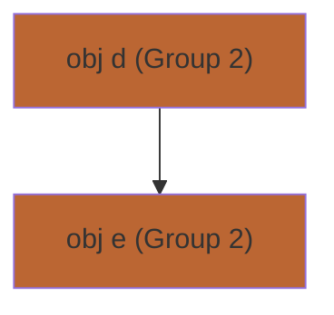
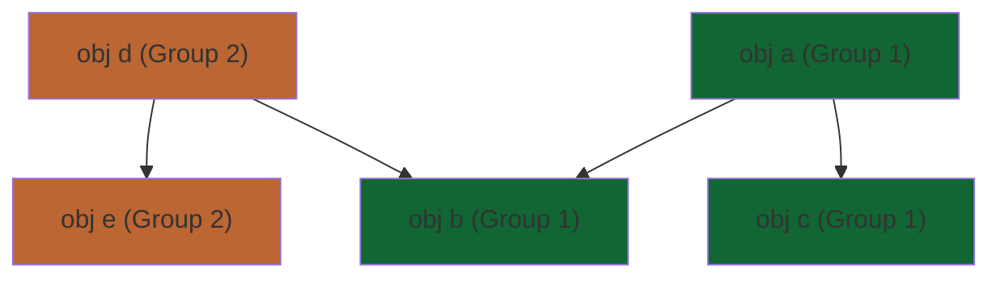
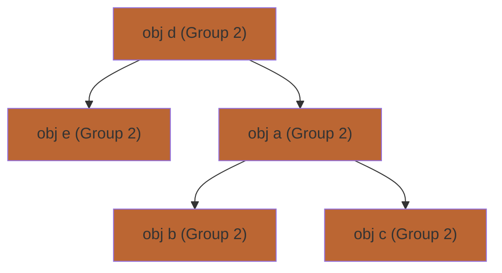
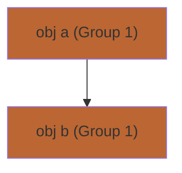

What is the expected behaviour of storing an isolated object inside another isolated object? More specifically, what is the expected behaviour if an object contained within an isolated object is put in the other isolated object? See example below for more clarification

This is related to https://github.com/jensdietrich/jdala/issues/17

## Example

Starting of with one isolated object and its children let's call this Group 1 (obj a, obj b, obj c)



Then you create another isolated object in this example this forms Group 2 (obj d, obj e)


And you add an element from Group 1 to Group 2



What should happen?
- Group 2 and Group 1 merge meaning they must both stay in the same thread as each-other
- obj b gets removed from Group 1 and added to Group 2
- Error gets thrown straight away
- Later on in the program when obj b is accessed in another thread other than Group 1's current registered thread an error is thrown

If it was the root object I am assuming that the whole group will just be merged into one group like below. Is that also the excepted behaviour
from adding a child object or should there be a different outcome?



## Related
Related to this if an isolated object no longer contains a reference to a child object should that object be able to move thread
freely without the parent object also needing to move thread.

```java
Box objB = new Box("foo");
@Isolated Box objA = new Box(objB);
```


```java
objA.value = null;
```

